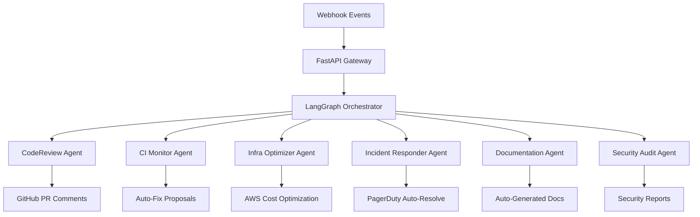

# DevOps OS 🚀

[](https://opensource.org/licenses/MIT)
[](https://www.python.org/downloads/)
[](https://fastapi.tiangolo.com/)
[](https://langchain-ai.github.io/langgraph/)
[](https://www.crewai.com/)

> **An autonomous AI-powered DevOps operating system** that orchestrates CI/CD, PR reviews, site reliability, architecture decisions, and incident management—without waking up human engineers at 3 AM.

---

## 🎯 Vision

Traditional DevOps is broken. Engineers burn out from alert fatigue, PR reviews bottleneck releases, and infrastructure waste goes unnoticed. **DevOps OS** changes the game by deploying a **swarm of specialized AI agents** that work 24/7 with the expertise of a 50-year veteran engineer.

Built with cutting-edge **agentic AI architecture** using LangGraph for orchestration and CrewAI for specialist execution, powered by **Claude 3.5 Sonnet** and **GPT-4o**.

---

## 🏗️ System Architecture



### Core Components

| Component | Technology | Purpose |
|-----------|-----------|---------|
| **Orchestrator** | LangGraph | Intelligent event routing and priority mapping |
| **Specialist Agents** | CrewAI | Domain-specific DevOps expertise |
| **API Layer** | FastAPI | High-performance webhook ingestion |
| **LLM Backend** | Claude 3.5 + GPT-4o | Reasoning and code analysis |
| **Audit Trail** | PostgreSQL | Complete system observability |

---

## 🤖 Agent Roster

### 1. **CodeReviewAgent** — Senior Staff Engineer
- **Mission**: Meticulous PR analysis with security-first mindset
- **Capabilities**: 
  - SOLID principles verification
  - Security vulnerability detection
  - Code quality scoring
  - Auto-comments on GitHub PRs

### 2. **CIMonitorAgent** — CI/CD Intelligence Engineer
- **Mission**: Diagnose pipeline failures with surgical precision
- **Capabilities**:
  - Build log parsing and root cause analysis
  - Auto-fix PR generation
  - Flaky test detection
  - Performance regression alerts

### 3. **InfraOptimizerAgent** — Cloud Cost Architect
- **Mission**: Eliminate infrastructure waste across multi-cloud
- **Capabilities**:
  - EC2 right-sizing recommendations
  - Unused resource detection
  - Terraform IaC optimization proposals
  - Cost anomaly alerts

### 4. **IncidentResponder** — Site Reliability Engine
- **Mission**: P1 incident response in <5 minutes
- **Capabilities**:
  - PagerDuty auto-acknowledgement
  - Runbook execution
  - Auto-mitigation actions
  - Human escalation when needed

### 5. **DocumentationAgent** — Technical Writer
- **Mission**: Keep docs in sync with code
- **Capabilities**:
  - Auto-generate API docs post-merge
  - README updates
  - Architecture diagram maintenance

### 6. **SecurityAuditAgent** — InfoSec Engineer
- **Mission**: Continuous security compliance
- **Capabilities**:
  - SAST/SCA scanning integration
  - CVE detection in dependencies
  - OWASP compliance checks
  - Secret detection in code

---

## ⚡ Quick Start

### Prerequisites

- Python 3.10+
- API keys for OpenAI and Anthropic
- Optional: GitHub, AWS, PagerDuty credentials for full functionality

### Installation

```bash
# Clone the repository
git clone https://github.com/rouviour-german/DevOps-AI-Engineer-Agent
cd DevOps-AI-Engineer-Agent

# Create virtual environment
python -m venv venv
source venv/bin/activate  # Windows: .\venv\Scripts\activate

# Install dependencies
pip install -r requirements.txt
```

### Configuration

```bash
# Copy environment template
cp .env.example .env

# Edit .env with your API keys
# Required: OPENAI_API_KEY, ANTHROPIC_API_KEY
# Optional: GITHUB_TOKEN, AWS credentials, PAGERDUTY_API_KEY
```

### Launch the System

```bash
# Start the FastAPI server
uvicorn main:app --reload --host 0.0.0.0 --port 8000
```

📡 **API Docs**: Visit `http://localhost:8000/docs` for interactive Swagger UI

---

## 🧪 Testing the Orchestrator

Fire a test event through the webhook:

```bash
curl -X POST http://localhost:8000/webhook \
  -H "Content-Type: application/json" \
  -d '{
    "trigger_type": "pr_opened",
    "repo": "rouviour-german/your-repo",
    "branch": "main",
    "payload": {"pr_number": 42}
  }'
```

Watch the terminal for real-time agent execution logs.

---

## 📊 Event Routing Matrix

| Trigger Type | Activated Agent | Priority | Response Time |
|--------------|-----------------|----------|---------------|
| `pr_opened` | CodeReviewAgent | P3 | ~30 seconds |
| `ci_failed` | CIMonitorAgent | P2 | ~15 seconds |
| `scheduled_infra` | InfraOptimizerAgent | P4 | Weekly |
| `pagerduty` | IncidentResponder | P1 | <5 minutes |
| `pr_merged` | DocumentationAgent | P3 | Post-merge |
| `scheduled_security` | SecurityAuditAgent | P4 | Weekly |

---

## 🛠️ Tech Stack

| Layer | Technology |
|-------|-----------|
| **Orchestration** | LangGraph, CrewAI |
| **API Framework** | FastAPI, Uvicorn |
| **LLM Providers** | Anthropic Claude 3.5, OpenAI GPT-4o |
| **Integrations** | GitHub API, AWS SDK, PagerDuty API |
| **Database** | PostgreSQL (audit trails) |
| **Deployment** | Docker, Docker Compose |

---

## 📁 Project Structure

```
DevOps-AI-Engineer-Agent/
├── main.py                 # FastAPI entry point
├── agent_graph.py          # LangGraph state machine
├── crew_agents.py          # CrewAI agent definitions
├── tools.py                # Integration tools (GitHub, AWS, PagerDuty)
├── tasks.py                # Agent task specifications
├── devops_agent_prompts.py # Prompt engineering templates
├── llm_config.py           # LLM configuration
├── database.py             # PostgreSQL audit logging
├── .env.example            # Environment template
├── docker-compose.yml      # Container orchestration
└── requirements.txt        # Python dependencies
```

---

## 🔐 Security & Compliance

- **No credentials stored in code** — All secrets via environment variables
- **Audit trail logging** — Every agent action tracked in PostgreSQL
- **Human-in-the-loop** — Critical actions require approval
- **Rate limiting** — API protection against abuse

---

## 🚀 Production Deployment

### Docker Deployment

```bash
# Build and run with Docker Compose
docker-compose up -d

# View logs
docker-compose logs -f
```

### Environment Variables (Production)

| Variable | Description | Required |
|----------|-------------|----------|
| `OPENAI_API_KEY` | OpenAI API credential | ✅ |
| `ANTHROPIC_API_KEY` | Anthropic API credential | ✅ |
| `GITHUB_TOKEN` | GitHub API token | ❌ |
| `AWS_ACCESS_KEY_ID` | AWS credential | ❌ |
| `AWS_SECRET_ACCESS_KEY` | AWS credential | ❌ |
| `PAGERDUTY_API_KEY` | PagerDuty credential | ❌ |
| `DATABASE_URL` | PostgreSQL connection string | ✅ |

---

## 📈 Roadmap

- [ ] **Slack Integration** — Real-time agent notifications
- [ ] **Jira Sync** — Auto-create tickets for actionable items
- [ ] **Multi-Cloud Support** — Azure, GCP cost optimization
- [ ] **Custom Runbooks** — User-defined incident response playbooks
- [ ] **Analytics Dashboard** — Grafana integration for agent metrics
- [ ] **Learning Loop** — Agent performance feedback and improvement

---

## 🤝 Contributing

Contributions are welcome! This is an open-source project built with passion by the DevOps community.

1. Fork the repository
2. Create a feature branch (`git checkout -b feature/amazing-feature`)
3. Commit your changes (`git commit -m 'Add amazing feature'`)
4. Push to the branch (`git push origin feature/amazing-feature`)
5. Open a Pull Request

---

## 📄 License

This project is licensed under the MIT License — see the [LICENSE](LICENSE) file for details.

---

## 🙏 Acknowledgments

- [LangChain](https://python.langchain.com/) for LangGraph
- [CrewAI](https://www.crewai.com/) for multi-agent orchestration
- [FastAPI](https://fastapi.tiangolo.com/) for the blazing-fast API framework
- [Anthropic](https://www.anthropic.com/) and [OpenAI](https://openai.com/) for LLM capabilities

---

<div align="center">

**🚀 DevOps OS — Where AI meets Infrastructure**

[Report Bug](https://github.com/rouviour-german/DevOps-AI-Engineer-Agent) · [Request Feature](https://github.com/rouviour-german/DevOps-AI-Engineer-Agent) · [View Demo](http://localhost:8000/docs)

</div>

---

## Author & Contact

- **GitHub:** [@rouviour-german](https://github.com/rouviour-german)
- **Email:** [rouviourgermanmeetings@gmail.com](mailto:rouviourgermanmeetings@gmail.com)
- **Profile:** https://github.com/rouviour-german

